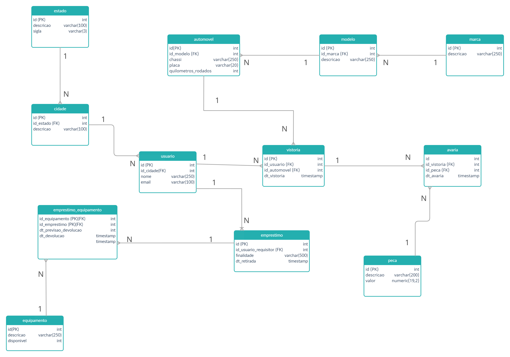

# Mestre dos códigos SQL - Escudeiro

**1 -** Crie um modelo de dados no formato de DER contendo pelo menos 10 tabelas, sendo que pelo menos uma tabela deve conter chave composta; Criar ligações entre as tabelas com relacionamentos N:N e 1:N.
> * **R:** 

**2 -** Com base no modelo criado no exercício 1, crie os códigos DDL para a criação das tabelas e os cuidados tomados com normalização e com a criação de índices;
> * **R:**
```sh
CREATE TABLE MARCA
(
    ID        INT PRIMARY KEY,
    DESCRICAO VARCHAR(250) NOT NULL
);

CREATE TABLE MODELO
(
    ID        INT PRIMARY KEY,
    DESCRICAO VARCHAR(250) NOT NULL,
    ID_MARCA  INT          NOT NULL,
    FOREIGN KEY (ID_MARCA) REFERENCES MARCA (ID)
);

CREATE TABLE AUTOMOVEL
(
    ID                  INT PRIMARY KEY,
    CHASSI              VARCHAR(250),
    PLACA               VARCHAR(20) NOT NULL,
    QUILOMETROS_RODADOS NUMBER(19),
    ID_MODELO           INT         NOT NULL,
    FOREIGN KEY (ID_MODELO) REFERENCES MODELO (ID)
);

CREATE TABLE ESTADO
(
    ID        INT PRIMARY KEY,
    DESCRICAO VARCHAR(100) NOT NULL,
    SIGLA     VARCHAR(3)   NOT NULL
);

CREATE TABLE CIDADE
(
    ID        INT PRIMARY KEY,
    DESCRICAO VARCHAR(100) NOT NULL,
    ID_ESTADO INT          NOT NULL,
    FOREIGN KEY (ID_ESTADO) REFERENCES ESTADO (ID)
);

CREATE TABLE USUARIO
(
    ID        INT PRIMARY KEY,
    NOME      VARCHAR(250) NOT NULL,
    EMAIL     VARCHAR(100) NOT NULL,
    ID_CIDADE INT          NOT NULL,
    FOREIGN KEY (ID_CIDADE) REFERENCES CIDADE (ID)
);

CREATE TABLE EQUIPAMENTO
(
    ID         INT PRIMARY KEY,
    DESCRICAO  VARCHAR(250) NOT NULL,
    DISPONIVEL INT          NOT NULL
);

CREATE TABLE EMPRESTIMO
(
    ID                    INT PRIMARY KEY NOT NULL,
    FINALIDADE            VARCHAR(500)    NOT NULL,
    DT_RETIRADA           TIMESTAMP DEFAULT CURRENT_TIMESTAMP,
    ID_USUARIO_REQUISITOR INT             NOT NULL,
    FOREIGN KEY (ID_USUARIO_REQUISITOR) REFERENCES USUARIO (ID)
);

CREATE TABLE EMPRESTIMO_EQUIPAMENTO
(
    ID_EQUIPAMENTO        INT NOT NULL,
    ID_EMPRESTIMO         INT NOT NULL,
    DT_PREVISAO_DEVOLUCAO TIMESTAMP,
    DT_DEVOLUCAO          TIMESTAMP,
    primary key (ID_EQUIPAMENTO, ID_EMPRESTIMO),
    FOREIGN KEY (ID_EMPRESTIMO) REFERENCES EMPRESTIMO (ID),
    FOREIGN KEY (ID_EQUIPAMENTO) REFERENCES EQUIPAMENTO (ID)
);

CREATE TABLE PECA
(
    ID        INT PRIMARY KEY,
    DESCRICAO VARCHAR(200)   NOT NULL,
    VALOR     NUMERIC(19, 2) NOT NULL
);

CREATE TABLE VISTORIA
(
    ID           INT PRIMARY KEY,
    DT_VISTORIA  TIMESTAMP NOT NULL,
    ID_AUTOMOVEL INT       NOT NULL,
    ID_USUARIO   INT       NOT NULL,
    FOREIGN KEY (ID_AUTOMOVEL) REFERENCES AUTOMOVEL (ID),
    FOREIGN KEY (ID_USUARIO) REFERENCES USUARIO (ID)
);

CREATE TABLE AVARIA
(
    ID        INT PRIMARY KEY,
    DT_AVARIA TIMESTAMP NOT NULL,
    ID_PECA   INT       NOT NULL,
    FOREIGN KEY (ID_PECA) REFERENCES PECA (ID)
);
```

**3 -** Extrair um relatório do modelo de dados criado no exercício 1, utilizando 3 funções de agregação diferentes, e filtrando por pelo menos uma função agregadora;
> * **R:**

**4 -** Criar uma query hierárquica, ordenando os registros por uma coluna específica;
> * **R:**

**5 -** Realize 5 consultas no modelo de dados criado no exercício 1, realizando pelo menos uma das seguintes operações: Union, Intersect, Minus, e utilizando pelo menos 3 tipos diferentes de joins;
> * **R:**

**6 -** O que são os comandos DML?
> - [x] Linguagem de Manipulação de Dados: Esses comandos indicam uma ação para o SGBD executar. Utilizados para recuperar, inserir e modificar um registro no banco de dados. Seus comandos são: INSERT, DELETE, UPDATE, SELECT e LOCK;
> - [ ] Linguagem de Definição de Dados: Comandos DDL são responsáveis pela criação, alteração e exclusão dos objetos no banco de dados. São eles: CREATE TABLE, CREATE INDEX, ALTER TABLE, DROP TABLE, DROP VIEW e DROP INDEX;
> - [ ] Linguagem de Controle de Dados: Responsável pelo controle de acesso dos usuários, controlando as sessões e transações do SGBD. Alguns de seus comandos são: COMMIT, ROLLBACK, GRANT e REVOKE.

**7 -** O que são os comandos DDL?
> - [ ] Linguagem de Manipulação de Dados: Esses comandos indicam uma ação para o SGBD executar. Utilizados para recuperar, inserir e modificar um registro no banco de dados. Seus comandos são: INSERT, DELETE, UPDATE, SELECT e LOCK;
> - [x] Linguagem de Definição de Dados: Comandos DDL são responsáveis pela criação, alteração e exclusão dos objetos no banco de dados. São eles: CREATE TABLE, CREATE INDEX, ALTER TABLE, DROP TABLE, DROP VIEW e DROP INDEX;
> - [ ] Linguagem de Controle de Dados: Responsável pelo controle de acesso dos usuários, controlando as sessões e transações do SGBD. Alguns de seus comandos são: COMMIT, ROLLBACK, GRANT e REVOKE.

**8 -** O que são os comandos DCL?
> - [ ] Linguagem de Manipulação de Dados: Esses comandos indicam uma ação para o SGBD executar. Utilizados para recuperar, inserir e modificar um registro no banco de dados. Seus comandos são: INSERT, DELETE, UPDATE, SELECT e LOCK;
> - [ ] Linguagem de Definição de Dados: Comandos DDL são responsáveis pela criação, alteração e exclusão dos objetos no banco de dados. São eles: CREATE TABLE, CREATE INDEX, ALTER TABLE, DROP TABLE, DROP VIEW e DROP INDEX;
> - [x] Linguagem de Controle de Dados: Responsável pelo controle de acesso dos usuários, controlando as sessões e transações do SGBD. Alguns de seus comandos são: COMMIT, ROLLBACK, GRANT e REVOKE.

**9 -** Temos 2 tabelas: serviceorder e client. Análise os códigos abaixo e aponte qual é o correto para a criação de uma chave estrangeira na tabela serviceorder referenciando a tabela client.
> **R:** Nenhum dos códigos apresentandos criariam a chave estrangeria corretamente, o código correto seria:
  ```sh
  ALTER TABLE serviceorder ADD FOREIGN KEY (id_client) REFERENCES client (id_client);
```
**10 -** Dado a tabela abaixo, criamos um comando de INSERT, no entanto ele esta apresentando um erro. Reescreva o código corrigindo-o:
>  **R:**  Para corrigir o comando sem conhecer a estrutura da tabela, foram criadas duas possíveis soluções.
>> Considerando o id como int
  ```sh
INSERT INTO cliente (id, nome_cliente, razao_social, dt_cadastro, cnpj, telefone, cidade, estado)
VALUES (1, 'AARONSON', 'AARONSON FURNITURE LTDA', '2015-02-17', '17.807.928/0001-85', '(21) 8167-6584', 'MARINGA', 'PR');
```
>> Considerando o id como varchar
  ```sh
INSERT INTO CLIENTE (id, nome_cliente, razao_social, dt_cadastro, cnpj, telefone, cidade, estado)
VALUES ('0001', 'AARONSON', 'AARONSON FURNITURE LTDA', '2015-02-17', '17.807.928/0001-85', '(21) 8167-6584', 'MARINGA', 'PR');
```
