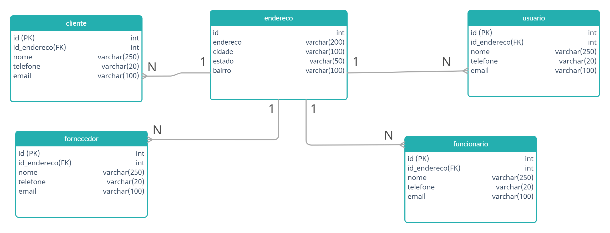

# Mestre dos códigos SQL - Escudeiro
> Os comandos SQL foram criados e executados em um banco de dados oracle versão 19, com exceção da questão 18 a qual foi executada em um banco de dados postgre

**1 -** Crie um modelo de dados no formato de DER contendo pelo menos 10 tabelas, sendo que pelo menos uma tabela deve conter chave composta; Criar ligações entre as tabelas com relacionamentos N:N e 1:N.
> * **R:** 

**2 -** Com base no modelo criado no exercício 1, crie os códigos DDL para a criação das tabelas e os cuidados tomados com normalização e com a criação de índices;
> * **R:**
```sh
CREATE TABLE MARCA
(
    ID        INT PRIMARY KEY,
    DESCRICAO VARCHAR(250) NOT NULL
);

CREATE TABLE MODELO
(
    ID        INT PRIMARY KEY,
    DESCRICAO VARCHAR(250) NOT NULL,
    ID_MARCA  INT          NOT NULL,
    FOREIGN KEY (ID_MARCA) REFERENCES MARCA (ID)
);

CREATE TABLE AUTOMOVEL
(
    ID                  INT PRIMARY KEY,
    CHASSI              VARCHAR(250),
    PLACA               VARCHAR(20) NOT NULL,
    QUILOMETROS_RODADOS NUMBER(19),
    ID_MODELO           INT         NOT NULL,
    FOREIGN KEY (ID_MODELO) REFERENCES MODELO (ID)
);

CREATE TABLE ESTADO
(
    ID        INT PRIMARY KEY,
    DESCRICAO VARCHAR(100) NOT NULL,
    SIGLA     VARCHAR(3)   NOT NULL
);

CREATE TABLE CIDADE
(
    ID        INT PRIMARY KEY,
    DESCRICAO VARCHAR(100) NOT NULL,
    ID_ESTADO INT          NOT NULL,
    FOREIGN KEY (ID_ESTADO) REFERENCES ESTADO (ID)
);

CREATE TABLE USUARIO
(
    ID        INT PRIMARY KEY,
    NOME      VARCHAR(250) NOT NULL,
    EMAIL     VARCHAR(100) NOT NULL,
    ID_CIDADE INT          NOT NULL,
    FOREIGN KEY (ID_CIDADE) REFERENCES CIDADE (ID)
);

CREATE TABLE EQUIPAMENTO
(
    ID         INT PRIMARY KEY,
    DESCRICAO  VARCHAR(250) NOT NULL,
    DISPONIVEL INT          NOT NULL
);

CREATE TABLE EMPRESTIMO
(
    ID                    INT PRIMARY KEY NOT NULL,
    FINALIDADE            VARCHAR(500)    NOT NULL,
    DT_RETIRADA           TIMESTAMP DEFAULT CURRENT_TIMESTAMP,
    ID_USUARIO_REQUISITOR INT             NOT NULL,
    FOREIGN KEY (ID_USUARIO_REQUISITOR) REFERENCES USUARIO (ID)
);

CREATE TABLE EMPRESTIMO_EQUIPAMENTO
(
    ID_EQUIPAMENTO        INT NOT NULL,
    ID_EMPRESTIMO         INT NOT NULL,
    DT_PREVISAO_DEVOLUCAO TIMESTAMP,
    DT_DEVOLUCAO          TIMESTAMP,
    primary key (ID_EQUIPAMENTO, ID_EMPRESTIMO),
    FOREIGN KEY (ID_EMPRESTIMO) REFERENCES EMPRESTIMO (ID),
    FOREIGN KEY (ID_EQUIPAMENTO) REFERENCES EQUIPAMENTO (ID)
);

CREATE TABLE PECA
(
    ID        INT PRIMARY KEY,
    DESCRICAO VARCHAR(200)   NOT NULL,
    VALOR     NUMERIC(19, 2) NOT NULL
);

CREATE TABLE VISTORIA
(
    ID           INT PRIMARY KEY,
    DT_VISTORIA  TIMESTAMP NOT NULL,
    ID_AUTOMOVEL INT       NOT NULL,
    ID_USUARIO   INT       NOT NULL,
    FOREIGN KEY (ID_AUTOMOVEL) REFERENCES AUTOMOVEL (ID),
    FOREIGN KEY (ID_USUARIO) REFERENCES USUARIO (ID)
);

CREATE TABLE AVARIA
(
    ID        INT PRIMARY KEY,
    DT_AVARIA TIMESTAMP NOT NULL,
    ID_PECA   INT       NOT NULL,
    FOREIGN KEY (ID_PECA) REFERENCES PECA (ID)
);
```

**3 -** Extrair um relatório do modelo de dados criado no exercício 1, utilizando 3 funções de agregação diferentes, e filtrando por pelo menos uma função agregadora;
> * **R:**


  ```sh
SELECT MA.DESCRICAO,
       MIN(A.QUILOMETROS_RODADOS) AS MENOSQUILOMETROS,
       MAX(A.QUILOMETROS_RODADOS) AS MAISQUILOMETROS,
       AVG(A.QUILOMETROS_RODADOS) AS MEDIAQUILOMETROS,
       COUNT(MA.ID)               AS QTDPORMARCA
FROM AUTOMOVEL A
         JOIN MODELO MO ON MO.ID = A.ID_MODELO
         JOIN MARCA MA ON MA.ID = MO.ID_MARCA
GROUP BY MA.DESCRICAO
HAVING COUNT(MA.ID) > 2;
```
**4 -** Criar uma query hierárquica, ordenando os registros por uma coluna específica;
> * **R:**

  ```sh
ALTER TABLE MARCA
    ADD ID_MARCA_PAI INT;

ALTER TABLE MARCA
    ADD FOREIGN KEY (ID_MARCA_PAI) REFERENCES MARCA (ID);

INSERT INTO MARCA (ID, DESCRICAO, ID_MARCA_PAI) VALUES (1, 'GM', null);
INSERT INTO MARCA (ID, DESCRICAO, ID_MARCA_PAI) VALUES (2, 'BMW', null);
INSERT INTO MARCA (ID, DESCRICAO, ID_MARCA_PAI) VALUES (3, 'Audi', null);
INSERT INTO MARCA (ID, DESCRICAO, ID_MARCA_PAI) VALUES (4, 'FIAT', null);
INSERT INTO MARCA (ID, DESCRICAO, ID_MARCA_PAI) VALUES (5, 'Ferrari', 4);

SELECT M.ID,
       M.DESCRICAO,
       M.ID_MARCA_PAI,
       LEVEL
FROM MARCA M
START WITH M.ID_MARCA_PAI IS NULL
CONNECT BY PRIOR ID = ID_MARCA_PAI
order SIBLINGS by DESCRICAO;
```
**5 -** Realize 5 consultas no modelo de dados criado no exercício 1, realizando pelo menos uma das seguintes operações: Union, Intersect, Minus, e utilizando pelo menos 3 tipos diferentes de joins;
> * **R:**
> > Consulta 1
  ```sh
  SELECT USUARIO.NOME, USUARIO.EMAIL, CID.DESCRICAO
FROM USUARIO
RIGHT JOIN CIDADE CID ON CID.ID = USUARIO.ID_CIDADE;
```
> > Consulta 2
  ```sh
SELECT NOME, DATA, TIPO
FROM (
         SELECT USUARIO.NOME, E.DT_RETIRADA AS DATA, 'EMPRÉSTIMO' AS TIPO
         FROM USUARIO
                  INNER JOIN EMPRESTIMO E ON USUARIO.ID = E.ID_USUARIO_REQUISITOR
         UNION
         SELECT USUARIO.NOME, V.DT_VISTORIA AS DATA, 'VISTORIA' AS TIPO
         FROM USUARIO
                  INNER JOIN VISTORIA V ON USUARIO.ID = V.ID_USUARIO);
```
> > Consulta 3
  ```sh
SELECT USUARIO.NOME, E.FINALIDADE, E.DT_RETIRADA
FROM USUARIO
         LEFT JOIN EMPRESTIMO E on USUARIO.ID = E.ID_USUARIO_REQUISITOR;
```
> > Consulta 4
  ```sh

SELECT NOME, DATA
FROM (
         SELECT USUARIO.NOME, TRUNC(E.DT_RETIRADA) AS DATA
         FROM USUARIO
                  INNER JOIN EMPRESTIMO E ON USUARIO.ID = E.ID_USUARIO_REQUISITOR
         INTERSECT
         SELECT USUARIO.NOME, TRUNC(V.DT_VISTORIA) AS DATA
         FROM USUARIO
                  INNER JOIN VISTORIA V ON USUARIO.ID = V.ID_USUARIO);
```
> > Consulta 5
  ```sh


SELECT NOME, DATA, CIDADE
FROM (
         SELECT USUARIO.NOME, TRUNC(E.DT_RETIRADA) AS DATA, C2.DESCRICAO AS CIDADE
         FROM USUARIO
                  INNER JOIN EMPRESTIMO E ON USUARIO.ID = E.ID_USUARIO_REQUISITOR
                  INNER JOIN CIDADE C2 on C2.ID = USUARIO.ID_CIDADE
         MINUS
         SELECT USUARIO.NOME, TRUNC(V.DT_VISTORIA) AS DATA, C2.DESCRICAO AS CIDADE
         FROM USUARIO
                  INNER JOIN VISTORIA V ON USUARIO.ID = V.ID_USUARIO
                  INNER JOIN CIDADE C2 on C2.ID = USUARIO.ID_CIDADE) WHERE CIDADE = 'Dois Vizinhos';
```

**6 -** O que são os comandos DML?
> - [x] Linguagem de Manipulação de Dados: Esses comandos indicam uma ação para o SGBD executar. Utilizados para recuperar, inserir e modificar um registro no banco de dados. Seus comandos são: INSERT, DELETE, UPDATE, SELECT e LOCK;
> - [ ] Linguagem de Definição de Dados: Comandos DDL são responsáveis pela criação, alteração e exclusão dos objetos no banco de dados. São eles: CREATE TABLE, CREATE INDEX, ALTER TABLE, DROP TABLE, DROP VIEW e DROP INDEX;
> - [ ] Linguagem de Controle de Dados: Responsável pelo controle de acesso dos usuários, controlando as sessões e transações do SGBD. Alguns de seus comandos são: COMMIT, ROLLBACK, GRANT e REVOKE.

**7 -** O que são os comandos DDL?
> - [ ] Linguagem de Manipulação de Dados: Esses comandos indicam uma ação para o SGBD executar. Utilizados para recuperar, inserir e modificar um registro no banco de dados. Seus comandos são: INSERT, DELETE, UPDATE, SELECT e LOCK;
> - [x] Linguagem de Definição de Dados: Comandos DDL são responsáveis pela criação, alteração e exclusão dos objetos no banco de dados. São eles: CREATE TABLE, CREATE INDEX, ALTER TABLE, DROP TABLE, DROP VIEW e DROP INDEX;
> - [ ] Linguagem de Controle de Dados: Responsável pelo controle de acesso dos usuários, controlando as sessões e transações do SGBD. Alguns de seus comandos são: COMMIT, ROLLBACK, GRANT e REVOKE.

**8 -** O que são os comandos DCL?
> - [ ] Linguagem de Manipulação de Dados: Esses comandos indicam uma ação para o SGBD executar. Utilizados para recuperar, inserir e modificar um registro no banco de dados. Seus comandos são: INSERT, DELETE, UPDATE, SELECT e LOCK;
> - [ ] Linguagem de Definição de Dados: Comandos DDL são responsáveis pela criação, alteração e exclusão dos objetos no banco de dados. São eles: CREATE TABLE, CREATE INDEX, ALTER TABLE, DROP TABLE, DROP VIEW e DROP INDEX;
> - [x] Linguagem de Controle de Dados: Responsável pelo controle de acesso dos usuários, controlando as sessões e transações do SGBD. Alguns de seus comandos são: COMMIT, ROLLBACK, GRANT e REVOKE.

**9 -** Temos 2 tabelas: serviceorder e client. Análise os códigos abaixo e aponte qual é o correto para a criação de uma chave estrangeira na tabela serviceorder referenciando a tabela client.
> **R:** Nenhum dos códigos apresentandos criariam a chave estrangeria corretamente, o código correto seria:
  ```sh
  ALTER TABLE serviceorder ADD FOREIGN KEY (id_client) REFERENCES client (id_client);
```
**10 -** Dado a tabela abaixo, criamos um comando de INSERT, no entanto ele esta apresentando um erro. Reescreva o código corrigindo-o:
>  **R:**  Para corrigir o comando sem conhecer a estrutura da tabela, foram criadas duas possíveis soluções.
>> Considerando o id como int
  ```sh
INSERT INTO cliente (id, nome_cliente, razao_social, dt_cadastro, cnpj, telefone, cidade, estado)
VALUES (1, 'AARONSON', 'AARONSON FURNITURE LTDA', '2015-02-17', '17.807.928/0001-85', '(21) 8167-6584', 'MARINGA', 'PR');
```
>> Considerando o id como varchar
  ```sh
INSERT INTO CLIENTE (id, nome_cliente, razao_social, dt_cadastro, cnpj, telefone, cidade, estado)
VALUES ('0001', 'AARONSON', 'AARONSON FURNITURE LTDA', '2015-02-17', '17.807.928/0001-85', '(21) 8167-6584', 'MARINGA', 'PR');
```

**11 -** Reescreva o código abaixo corrigindo o comando:
>  **R:**  
  ```sh
UPDATE client
SET name = 'FULANO DE TAL',
    cnpj = '17807928000185'
WHERE id = 3234;
```

**12 -** Você precisa montar um relatório para buscar os vendedores agrupados por nome, cliente e mostrando o total que cada um realizou de vendas por cliente. Para isso considere as seguintes tabelas:
>  **R:** 
```sh
SELECT VENDEDOR.NOME, C2.NOME AS NOME_CLIENTE, SUM(V.TOTALVENDA) AS TOTAL_VENDA
FROM VENDEDOR
         JOIN VENDAS V ON VENDEDOR.ID = V.VENDEDORID
         JOIN CLIENTE C2 ON V.CLIENTEID = C2.ID
GROUP BY VENDEDOR.NOME, C2.NOME;
```

**13 -** Utilizamos a função GROUP BY para agrupar informações iguais de determidas colunas. Com base nos seus conhecimentos a respeito da função GROUP BY, assinale o código correto:
> - [x] Opção 1

  ```sh
     SELECT c.nome, sum(v.total_venda)
     FROM cliente c
     INNER JOIN vendas v on v.id_cliente = c.id
     WHERE v.dt_venda > '01/01/2019'
     GROUP BY c.nome
     ORDER BY 1
```
> - [ ] Opção 2

  ```sh
     SELECT c.nome, sum(v.total_venda)
     FROM cliente c
     INNER JOIN vendas v on v.id_cliente = c.id
     WHERE v.dt_venda > '01/01/2019'
     ORDER BY c.nome
     GROUP BY c.nome, c.telefone
```
> - [ ] Opção 3

  ```sh
     SELECT c.nome, sum(v.total_venda)
     FROM cliente
     INNER JOIN vendas v on v.id_cliente = c.id
     WHERE v.dt_venda > '01/01/2019'
     GROUP BY c.nome
     ORDER BY nome
```

**14 -** Muitas vezes queremos buscar um registro no banco de dados mas não sabemos o termo completo que queremos consultar. Ex: Você foi instruído para consultar o nome de todos os clientes que possuem o texto "Souza" no nome. Para isso você recebeu o comando abaixo incorreto. Análise a consulta e reescreva da maneira correta.
>  **R:** 
  ```sh
   SELECT nome
   FROM cliente
   WHERE nome like '%Souza%'
```
**15 -** A tabela "cliente" foi criada com a estrutura incorreta. Agora você precisa criar um comando para excluir essa tabela do banco de dados. Assinale a alternativa correta.
> - [ ] Table delete cliente;
> - [ ] Drop delete cliente;
> - [ ] Delete table cliente;
> - [x] Drop table cliente;
> - [ ] Cliente drop table;

**16 -** É muito comum termos a necessidade de buscar diversas informações utilizando um único comando. Ex: Precisamos trazer em uma única consulta todos os nomes dos clientes referentes aos ids "12", "10", "199", "18", "01", "2016". Construa uma consulta utilizando a tabela "cliente" e o campo "id"
>  **R:** 
  ```sh
    SELECT *
    FROM cliente
    WHERE id IN (12, 10, 199, 18, 01, 2016);
```
**17 -** Dado que temos as duas tabelas abaixo:
> - [x] Opção 1
 ```sh
     SELECT c.nome, c.email
     FROM cliente c
     INNER JOIN vendas v on v.clienteID = c.id
     WHERE v.dt_venda > '01/01/2019'
     ORDER BY 1
```
> - [ ] Opção 2
 ```sh
     SELECT c.nome, c.email
     FROM cliente c, vendas v
     WHERE v.dt_venda > '01/01/2019'
     AND v.clienteID = c.id
     ORDER BY c.nome, c.dtcriacao
 ```
> - [ ] Opção 3
 ```sh
     SELECT c.nome, c.email
     FROM cliente c, vendas v
     WHERE v.dt_venda > '01/01/2019'
     INNER JOIN on v.clienteID = c.id
     AND v.clienteID = c.id
     ORDER BY c.nome, c.dtcriacao
 ```
> - [ ] Opção 4
 ```sh
     SELECT c.nome, c.email
     FROM cliente c, vendas v
     WHERE dt_venda > '01/01/2019'
     AND v.clienteID = c.id
     ORDER BY c.nome, c.dtcriacao
 ```

**18 -** Analise o cenário:
> Você tem um banco de dados com as tabelas abaixo:
> > Após a criação das tabelas foram inseridos os seguintes registros:
> > 
> > O analista responsável pelo gerenciamento do banco de dados precisa excluir a tabela cliente. Levando em consideração o relacionamento entre as duas tabelas. Como seria o único comando que iria excluir a tabela cliente e vendas de uma só vez.
>  **R:** 
 ```sh
DROP TABLE vendas, cliente;
 ```

**19 -** A tabela cliente do produto que você trabalha, possuí os seguintes campos:
> Nome; Telefone; Email; Endereco; Cidade; Estado; Bairro.
> 
> Com o aumento da complexidade do produto, surgiu a necessidade de criar uma estrutura de tabelas para armazenar endereços que será utilizada por outras tabelas como usuario, fornecedor e funcionario. Sabendo disso, a sua missão é criar essa nova estrutura de tabelas de endereços que será utilizada nos demais locais do produto. Crie um modelo de dados no formato de DER com as tabelas dessa nova estrutura.
> * **R:** 

**20 -** Com base no modelo anterior de endereços, crie os códigos DDL para criação das tabelas e os cuidados tomados com normalização e com a criação de índices;
>  **R:** 
```sh

CREATE TABLE ENDERECO
(
    ID       INT PRIMARY KEY,
    ENDERECO VARCHAR(200) NOT NULL,
    CIDADE   VARCHAR(100) NOT NULL,
    ESTADO   VARCHAR(50)  NOT NULL,
    BAIRRO   VARCHAR(100) NOT NULL
);

CREATE TABLE CLIENTE
(
    ID          INT PRIMARY KEY,
    NOME        VARCHAR(250) NOT NULL,
    TELEFONE    VARCHAR(20)  NOT NULL,
    EMAIL       VARCHAR(100) NOT NULL,
    ID_ENDERECO INT          NOT NULL,
    FOREIGN KEY (ID_ENDERECO) REFERENCES ENDERECO (ID)
);


CREATE TABLE USUARIO
(
    ID          INT PRIMARY KEY,
    NOME        VARCHAR(250) NOT NULL,
    TELEFONE    VARCHAR(20)  NOT NULL,
    EMAIL       VARCHAR(100) NOT NULL,
    ID_ENDERECO INT          NOT NULL,
    FOREIGN KEY (ID_ENDERECO) REFERENCES ENDERECO (ID)
);

CREATE TABLE FUNCIONARIO
(
    ID          INT PRIMARY KEY,
    NOME        VARCHAR(250) NOT NULL,
    TELEFONE    VARCHAR(20)  NOT NULL,
    EMAIL       VARCHAR(100) NOT NULL,
    ID_ENDERECO INT          NOT NULL,
    FOREIGN KEY (ID_ENDERECO) REFERENCES ENDERECO (ID)
);


CREATE TABLE FORNECEDOR
(
    ID          INT PRIMARY KEY,
    NOME        VARCHAR(250) NOT NULL,
    TELEFONE    VARCHAR(20)  NOT NULL,
    EMAIL       VARCHAR(100) NOT NULL,
    ID_ENDERECO INT          NOT NULL,
    FOREIGN KEY (ID_ENDERECO) REFERENCES ENDERECO (ID)
);
 ```
